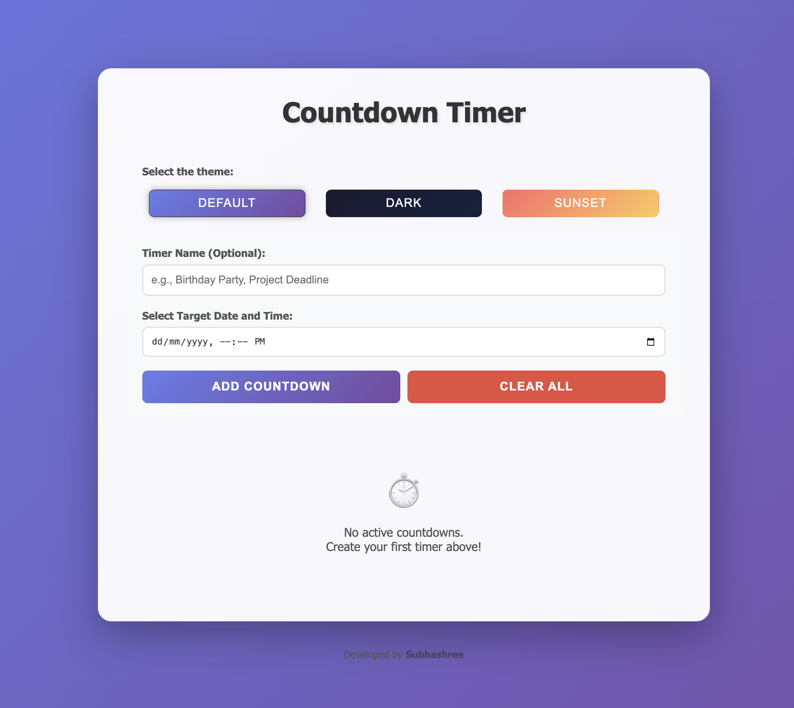
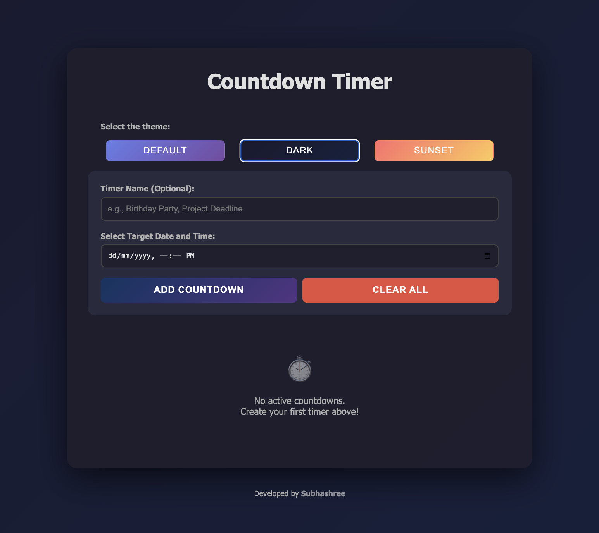
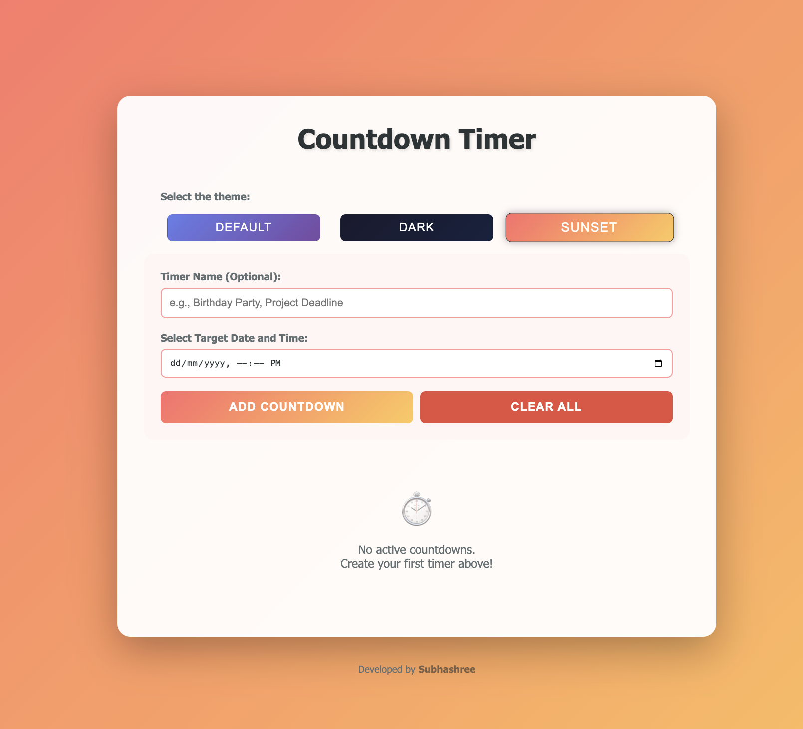

# ⏳ Countdown Timer
A simple and interactive Countdown Timer web app built using HTML, CSS, and JavaScript. Users can select any future date and time, and the timer will dynamically count down in days, hours, minutes, and seconds until the target moment. Designed with a clean UI and real-time updates using setInterval() for smooth countdown behavior.

A responsive and easy-to-use Countdown Timer web app built with **HTML**, **CSS**, and **JavaScript**.

## 🚀 Features
- Select a future date and time.
- Real-time countdown display (Days, Hours, Minutes, Seconds).
- Auto-stops when countdown reaches zero.
- Clean and modern UI design.

## 🛠️ Technologies Used
- HTML5  
- CSS3  
- JavaScript (ES6)

## 💻 Preview

  
  
  

